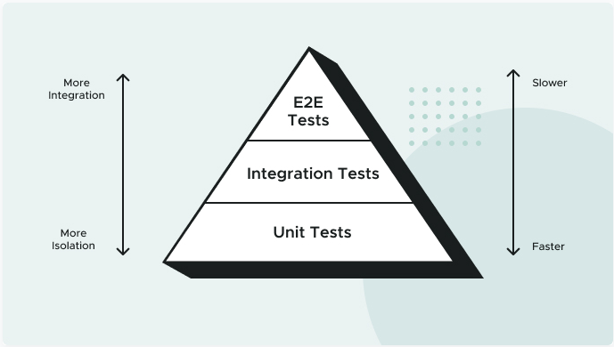

# The Testing Pyramid

Different tests can be written at different levels of the system. At each level, there is a balance between the speed of execution, the “cost” to maintain the test, and the confidence it brings to system correctness. This hierarchy is often represented as a “testing pyramid”.

**Unit Tests:** A Unit Test exercises a small “unit” of the system that is isolated from the rest of the system. They should be simple and speedy. You want a high ratio of Unit Tests in your testing pyramid as they’re key to designing highly cohesive, loosely coupled software.

**Integration Tests:** Integration Tests exercise a subset of the system and may exercise groups of units in one test. They are more complicated to write and maintain, and run slower than unit tests.

**End-to-End Tests:** An End-to-End Test exercises the system using the same interface that a user would, such as a web browser. While extremely thorough, End-to-End Tests can be very slow and fragile because they use simulated user interactions in potentially complicated UIs. Implement the smallest number of these tests.